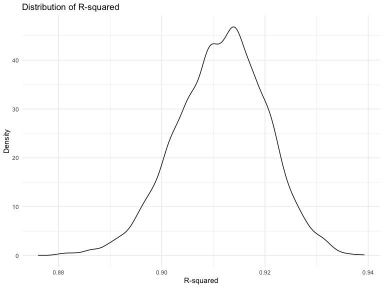

Homework 6 solutions
================
Tianheng Hu
2020-12-09

``` r
library(tidyverse)
library(modelr)
library(p8105.datasets)
```

### Problem 1

``` r
homicide_df = 
  read_csv("data/homicide-data.csv", na = c("", "NA", "Unknown")) %>% 
  mutate(
    city_state = str_c(city, state, sep = ", "),
    victim_age = as.numeric(victim_age),
    resolution = case_when(
      disposition == "Closed without arrest" ~ 0,
      disposition == "Open/No arrest"        ~ 0,
      disposition == "Closed by arrest"      ~ 1)
  ) %>% 
  filter(
    victim_race %in% c("White", "Black"),
    city_state != "Tulsa, AL") %>% 
  select(city_state, resolution, victim_age, victim_race, victim_sex)
```

    ## Parsed with column specification:
    ## cols(
    ##   uid = col_character(),
    ##   reported_date = col_double(),
    ##   victim_last = col_character(),
    ##   victim_first = col_character(),
    ##   victim_race = col_character(),
    ##   victim_age = col_double(),
    ##   victim_sex = col_character(),
    ##   city = col_character(),
    ##   state = col_character(),
    ##   lat = col_double(),
    ##   lon = col_double(),
    ##   disposition = col_character()
    ## )

Start with one city.

``` r
baltimore_df =
  homicide_df %>% 
  filter(city_state == "Baltimore, MD")
glm(resolution ~ victim_age + victim_race + victim_sex, 
    data = baltimore_df,
    family = binomial()) %>% 
  broom::tidy() %>% 
  mutate(
    OR = exp(estimate),
    CI_lower = exp(estimate - 1.96 * std.error),
    CI_upper = exp(estimate + 1.96 * std.error)
  ) %>% 
  select(term, OR, starts_with("CI")) %>% 
  knitr::kable(digits = 3)
```

| term              |    OR | CI\_lower | CI\_upper |
| :---------------- | ----: | --------: | --------: |
| (Intercept)       | 1.363 |     0.975 |     1.907 |
| victim\_age       | 0.993 |     0.987 |     1.000 |
| victim\_raceWhite | 2.320 |     1.648 |     3.268 |
| victim\_sexMale   | 0.426 |     0.325 |     0.558 |

Try this across cities.

``` r
models_results_df = 
  homicide_df %>% 
  nest(data = -city_state) %>% 
  mutate(
    models = 
      map(.x = data, ~glm(resolution ~ victim_age + victim_race + victim_sex, data = .x, family = binomial())),
    results = map(models, broom::tidy)
  ) %>% 
  select(city_state, results) %>% 
  unnest(results) %>% 
  mutate(
    OR = exp(estimate),
    CI_lower = exp(estimate - 1.96 * std.error),
    CI_upper = exp(estimate + 1.96 * std.error)
  ) %>% 
  select(city_state, term, OR, starts_with("CI")) 
```

``` r
models_results_df %>% 
  filter(term == "victim_sexMale") %>% 
  mutate(city_state = fct_reorder(city_state, OR)) %>% 
  ggplot(aes(x = city_state, y = OR)) + 
  geom_point() + 
  geom_errorbar(aes(ymin = CI_lower, ymax = CI_upper)) + 
  theme(axis.text.x = element_text(angle = 90, hjust = 1))
```


## Problem 2

Load and tidy the datasets.

``` r
baby_df = 
  read_csv("./data/birthweight.csv") %>% 
  mutate(babysex= as.factor(babysex),
         frace= as.factor(frace),
         malform = as.factor(malform),
         mrace = as.factor(mrace)) %>% 
  drop_na()
```

    ## Parsed with column specification:
    ## cols(
    ##   .default = col_double()
    ## )

    ## See spec(...) for full column specifications.

The birthweight dataset contains 4342 rows and 20 columns.

Fit a model.

``` r
model_fit = lm(bwt ~ ., data = baby_df)
step.model <- step(model_fit, direction = "both", 
                      trace = FALSE)
summary(step.model)
```

    ## 
    ## Call:
    ## lm(formula = bwt ~ babysex + bhead + blength + delwt + fincome + 
    ##     gaweeks + mheight + mrace + parity + ppwt + smoken, data = baby_df)
    ## 
    ## Residuals:
    ##      Min       1Q   Median       3Q      Max 
    ## -1097.18  -185.52    -3.39   174.14  2353.44 
    ## 
    ## Coefficients:
    ##               Estimate Std. Error t value Pr(>|t|)    
    ## (Intercept) -6098.8219   137.5463 -44.340  < 2e-16 ***
    ## babysex2       28.5580     8.4549   3.378 0.000737 ***
    ## bhead         130.7770     3.4466  37.944  < 2e-16 ***
    ## blength        74.9471     2.0190  37.120  < 2e-16 ***
    ## delwt           4.1067     0.3921  10.475  < 2e-16 ***
    ## fincome         0.3180     0.1747   1.820 0.068844 .  
    ## gaweeks        11.5925     1.4621   7.929 2.79e-15 ***
    ## mheight         6.5940     1.7849   3.694 0.000223 ***
    ## mrace2       -138.7925     9.9071 -14.009  < 2e-16 ***
    ## mrace3        -74.8868    42.3146  -1.770 0.076837 .  
    ## mrace4       -100.6781    19.3247  -5.210 1.98e-07 ***
    ## parity         96.3047    40.3362   2.388 0.017004 *  
    ## ppwt           -2.6756     0.4274  -6.261 4.20e-10 ***
    ## smoken         -4.8434     0.5856  -8.271  < 2e-16 ***
    ## ---
    ## Signif. codes:  0 '***' 0.001 '**' 0.01 '*' 0.05 '.' 0.1 ' ' 1
    ## 
    ## Residual standard error: 272.3 on 4328 degrees of freedom
    ## Multiple R-squared:  0.7181, Adjusted R-squared:  0.7173 
    ## F-statistic: 848.1 on 13 and 4328 DF,  p-value: < 2.2e-16

I used stepwise selection method to choose an appropriate model. The
selection leaves me babysex, bhead , blength, delwt, fincome, gaweeks,
mheight, mrace, parity, ppwt and smoken as significant predictors.

Use those final predictors to run a final regression model.

``` r
final_mod = lm(bwt ~ babysex + bhead + blength + delwt + fincome + gaweeks + mheight + mrace + parity + ppwt + smoken, data = baby_df) 

final_mod %>% 
  broom::tidy() %>% 
  knitr::kable(digits = 3)
```

| term        |   estimate | std.error | statistic | p.value |
| :---------- | ---------: | --------: | --------: | ------: |
| (Intercept) | \-6098.822 |   137.546 |  \-44.340 |   0.000 |
| babysex2    |     28.558 |     8.455 |     3.378 |   0.001 |
| bhead       |    130.777 |     3.447 |    37.944 |   0.000 |
| blength     |     74.947 |     2.019 |    37.120 |   0.000 |
| delwt       |      4.107 |     0.392 |    10.475 |   0.000 |
| fincome     |      0.318 |     0.175 |     1.820 |   0.069 |
| gaweeks     |     11.592 |     1.462 |     7.929 |   0.000 |
| mheight     |      6.594 |     1.785 |     3.694 |   0.000 |
| mrace2      |  \-138.792 |     9.907 |  \-14.009 |   0.000 |
| mrace3      |   \-74.887 |    42.315 |   \-1.770 |   0.077 |
| mrace4      |  \-100.678 |    19.325 |   \-5.210 |   0.000 |
| parity      |     96.305 |    40.336 |     2.388 |   0.017 |
| ppwt        |    \-2.676 |     0.427 |   \-6.261 |   0.000 |
| smoken      |    \-4.843 |     0.586 |   \-8.271 |   0.000 |

``` r
baby_df %>% 
  modelr::add_residuals(final_mod) %>% 
  modelr::add_predictions(final_mod) %>% 
  ggplot(aes(x = pred, y = resid)) + 
  geom_point()  +
labs(title = "Model residuals against Fitted values", 
    x = "Fitted Value",
     y = "Residuals")
```


The residuals are randomly scattered around y = 0. Therefore, the model
is an appropriate model for this birthweight data.

Compare model with the other two using cross validation.

``` r
cv_df = 
  crossv_mc(baby_df, 100) 

cv_df =
  cv_df %>% 
  mutate(
    train = map(train, as_tibble),
    test = map(test, as_tibble))

cv_df = 
  cv_df %>% 
  mutate(
    final_mod  = map(train, ~lm(bwt ~ babysex + bhead + blength + delwt + fincome + gaweeks + mheight + mrace + parity + ppwt + smoken, data = .x)),
    mod1 = map(train, ~lm(bwt ~ blength + gaweeks, data = .x)),
    mod2  = map(train, ~lm(bwt ~ bhead +  blength + babysex + babysex * blength + babysex * bhead + blength * bhead + babysex * blength * bhead, data = .x))) %>% 
  mutate(
    rmse_final = map2_dbl(final_mod, test, ~rmse(model = .x, data = .y)),
    rmse1 = map2_dbl(mod1, test, ~rmse(model = .x, data = .y)),
    rmse2 = map2_dbl(mod2, test, ~rmse(model = .x, data = .y))) 
```

Make a plot to compare rmse for three models.

``` r
cv_df %>% 
  select(starts_with("rmse")) %>% 
  pivot_longer(
    everything(),
    names_to = "model", 
    values_to = "rmse",
    names_prefix = "rmse_") %>% 
  mutate(model = fct_inorder(model)) %>% 
  ggplot(aes(x = model, y = rmse)) + geom_violin()
```


From the plot above, the final model that I built has the lowest mean
rmse. Therefore, this model is the best.

# Question 3

``` r
weather_df = 
  rnoaa::meteo_pull_monitors(
    c("USW00094728"),
    var = c("PRCP", "TMIN", "TMAX"), 
    date_min = "2017-01-01",
    date_max = "2017-12-31") %>%
  mutate(
    name = recode(id, USW00094728 = "CentralPark_NY"),
    tmin = tmin / 10,
    tmax = tmax / 10) %>%
  select(name, id, everything())
```

    ## Registered S3 method overwritten by 'hoardr':
    ##   method           from
    ##   print.cache_info httr

    ## using cached file: /Users/jadyhu/Library/Caches/R/noaa_ghcnd/USW00094728.dly

    ## date created (size, mb): 2020-12-06 21:49:49 (7.536)

    ## file min/max dates: 1869-01-01 / 2020-12-31

Fit a simple linear regression with Tmax on Tmin

``` r
model = lm(tmax ~ tmin, data = weather_df)
summary(model)
```

    ## 
    ## Call:
    ## lm(formula = tmax ~ tmin, data = weather_df)
    ## 
    ## Residuals:
    ##     Min      1Q  Median      3Q     Max 
    ## -6.0304 -2.1245  0.0264  1.7264  9.4915 
    ## 
    ## Coefficients:
    ##             Estimate Std. Error t value Pr(>|t|)    
    ## (Intercept)  7.20850    0.22635   31.85   <2e-16 ***
    ## tmin         1.03924    0.01699   61.16   <2e-16 ***
    ## ---
    ## Signif. codes:  0 '***' 0.001 '**' 0.01 '*' 0.05 '.' 0.1 ' ' 1
    ## 
    ## Residual standard error: 2.938 on 363 degrees of freedom
    ## Multiple R-squared:  0.9115, Adjusted R-squared:  0.9113 
    ## F-statistic:  3741 on 1 and 363 DF,  p-value: < 2.2e-16

``` r
boot_sample = function(df) {
  sample_frac(df, replace = TRUE)
}
boot_straps = 
  data_frame(
    strap_number = 1:5000,
    strap_sample = rerun(5000, boot_sample(weather_df))
  )

boot_straps
```

    ## # A tibble: 5,000 x 2
    ##    strap_number strap_sample      
    ##           <int> <list>            
    ##  1            1 <tibble [365 × 6]>
    ##  2            2 <tibble [365 × 6]>
    ##  3            3 <tibble [365 × 6]>
    ##  4            4 <tibble [365 × 6]>
    ##  5            5 <tibble [365 × 6]>
    ##  6            6 <tibble [365 × 6]>
    ##  7            7 <tibble [365 × 6]>
    ##  8            8 <tibble [365 × 6]>
    ##  9            9 <tibble [365 × 6]>
    ## 10           10 <tibble [365 × 6]>
    ## # … with 4,990 more rows

Get the adjusted R square.

``` r
bootstrap_results = 
boot_straps %>% 
  mutate(models = map(strap_sample, ~lm(tmax ~ tmin, data = .x)),
    results = map(models, broom::glance),
    results_coeff = map(models, broom::tidy)) %>% 
  select(-strap_sample, -models) %>% 
  unnest() %>% 
  select(term, estimate, r.squared) 
  
bootstrap_results %>%   
  select(r.squared) 
```

    ## # A tibble: 10,000 x 1
    ##    r.squared
    ##        <dbl>
    ##  1     0.915
    ##  2     0.915
    ##  3     0.921
    ##  4     0.921
    ##  5     0.911
    ##  6     0.911
    ##  7     0.921
    ##  8     0.921
    ##  9     0.919
    ## 10     0.919
    ## # … with 9,990 more rows

``` r
bootstrap_results %>% 
ggplot(aes(x = r.squared)) + geom_density()+
   labs(title = "Distribution of R-squared", 
       x = "R-squared",
       y = "Density")
```



The 95% CI limit for adjusted R square is between 0.8938429 and
0.9277504

``` r
bootstrap_logestimates = bootstrap_results %>% 
  pivot_wider(
    names_from = term,
    values_from = estimate
  ) %>% 
  rename(
    beta_0 = "(Intercept)",
    beta_1 = "tmin",
  ) %>% 
  mutate(
    log_coef = log(beta_0*beta_1)
  )

bootstrap_logestimates%>% 
ggplot(aes(x = log_coef)) + geom_density()+
   labs(title = "Distribution of log_eff", 
       x = "log_coef",
       y = "Density")
```


The 95% CI limit for logcoef is between 1.9645945 and 2.0584628
